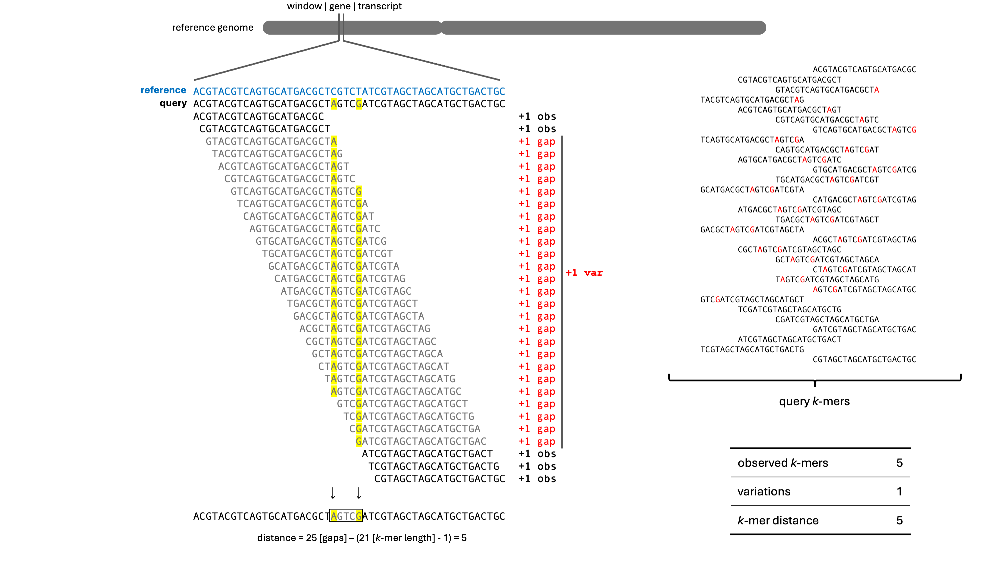
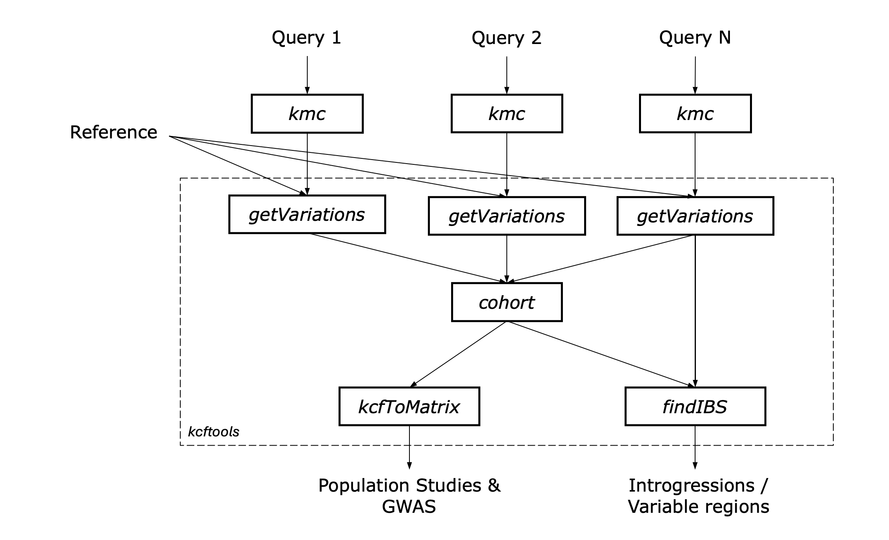

<!--- badge: start --->
[](https://github.com/sivasubramanics/kcftools/releases)
[](https://anaconda.org/bioconda/kcftools)
[](https://github.com/sivasubramanics/kcftools/actions/workflows/release.yml)
[](https://github.com/sivasubramanics/kcftools/releases)
[](https://www.gnu.org/licenses/gpl-3.0.html)
[](https://kcftools.readthedocs.io)
<!--- badges: end --->

# KCFTOOLS

**KCFTOOLS** is a Java-based toolset for identifying genomic variations through counting kmer presence/absence between reference and query genomes. It utilizes precomputed *k*-mer count databases (from [KMC](https://github.com/refresh-bio/KMC)) to perform a wide array of genomic analyses including variant detection, IBS window identification, and genotype matrix generation.

Detailed documentation is available at **[kcftools.readthedocs.io](https://kcftools.readthedocs.io)**.

---
### Quick Start

To quickly get started with `kcftools`, refer to the [`run_kcftools.sh`](https://github.com/sivasubramanics/kcftools/blob/v0.0.1/utils/run_kcftools.sh) script located in the `utils` directory. Assuming that you have installed `kcftools` via Bioconda.

---

## Contents
- [Introduction](#inon)
- [Methodology](#methodology)
- [Workflow](#workflow)
- [Features](#features)
- [Installation](#installation)
- [Limitations and Performance Notes](#-limitations-and-performance-notes)
- [Usage](#usage)
   - [kmc database](#kmc-database)
   - [General Usage](#general-usage)
   - [getVariations](#getvariations)
   - [cohort](#cohort)
   - [findIBS](#findibs)
   - [splitKCF](#splitkcf)
   - [getAttributes](#getattributes)
   - [kcf2tsv](#kcf2tsv)
   - [increaseWindow](#increasewindow)
   - [kcf2plink](#kcf2plink)
   - [scoreRecalc](#scorerecalc)
   - [kcf2gt](#kcf2gt)
- [KCF File Format](#kcf-file-format)
  - [KCF Header format](#kcf-file-header-description)
  - [KCF Data format](#kcf-file-data-column-description)
- [LICENSE](#license)
- [Contact](#contact)

---

## Introduction

KCFTOOLS is designed for high-throughput genomic analysis using efficient *k*-mer based methods. By leveraging fast *k*-mer counting from tools like KMC, KCFTOOLS can rapidly compare genome samples to a reference, identify variations, and produce downstream outputs useful for population genetics and comparative genomics studies.


## Methodology

KCFTOOLS (specifically the `getVariations` plugin), splits the reference sequence into non-overlapping windows: either fixed-length regions, gene models, or transcript features from a GTF file—and the presence of reference *k*-mers is screened against query *k*-mer databases built using KMC3. For each window, the number of observed *k*-mers is counted, and variations are identified as consecutive gaps between matching *k*-mers. These gaps are used to compute the *k*-mer distance, representing the number of bases not covered by observed *k*-mers. This distance is divided into inner distance (gaps between hits within the window) and tail distance (gaps at the window edges), providing a detailed measure of sequence divergence or gene loss at multiple resolutions. The identity score for each window is being calculated using the below formula,

$$
\text{Identity Score} = W_o \cdot \left( \frac{\text{obs k-mers}}{\text{total k-mers}} \right) + W_i \cdot \left( 1 - \frac{\text{inner dist}}{\text{eff length}} \right) + W_t \cdot \left( 1 - \frac{\text{tail dist}}{\text{eff length}} \right) \cdot 100
$$

where:
- $W_o$ , $W_i$ , $W_t$ are weights assigned to the *k*-mer ratio, inner distance, and tail distance respectively.
- **obs *k*-mers**: Number of *k*-mers from the reference window found in the query *k*-mer table.
- **total *k*-mers**: Total number of *k*-mers from the reference window.
- **inner dist**: Cumulative number of bases not covered by *k*-mers between hits within the window.
- **tail dist**: Uncovered base positions at the start and end of the window (flanking gaps).
- **eff length**: Effective length of the window (in base pairs), length of the reference window that is covered by total_kmers.


_Figure: Overview of the `kcftools getVariations` methodology._

---

## Features

- **Screen for Variations**: Detect sequence variations by comparing *k*-mers from reference and sample.
- **Cohort Creation**: Merge multiple `.kcf` sample files into a unified cohort.
- **IBS Window Identification**: Identify Identity-by-State (IBS) windows or variable regions across samples.
- **Chromosome-wise Splitting**: Partition KCF files by chromosome for parallel or targeted analysis.
- **Attribute Extraction**: Generate summaries and detailed statistics from `.kcf` files.
- **Genotype Table Generation**: Convert `.kcf` files into population-level genotype table.
- **Window Composition**: Compose larger genomic windows from finer-grained `.kcf` data.
- **Conversion Utilities**: Export `.kcf` files to TSV format (to replicate IBSpy-like output).

---

## Workflow


_Figure: Overview of the `kcftools` workflow_

---

## Installation

You can install **kcftools** using either **Bioconda** or from source.

### 1. Using Bioconda (recommended)

If you have Bioconda set up, simply run:

```bash
conda install -c bioconda kcftools
```

### 2. From Source

#### Requirements

- **Java 17+**
- **Maven** (for building)

#### Steps

1. Clone the repository:

   ```bash
   git clone https://github.com/sivasubramanics/kcftools.git
   cd kcftools
   ```

2. Build the project using Maven:

   ```bash
   mvn clean package
   ```

3. The JAR file will be located in the `target` directory:

   ```bash
   ls target/kcftools-<version>.jar
   ```

4. Run the tool:

   ```bash
   java -jar target/kcftools-<version>.jar <command> [options]
   ```

---

## ⚠️ Limitations and Performance Notes

1. **KMC DB Compatibility**:
    - `getVariations` plugin works only with KMC databases produced by `kmc` version 3.0.0 or higher. 
    - This version currently supports only KMC database files generated with a **signature length of 9** (i.e., using `-p 9`).  
   Files created with other signature lengths are not guaranteed to work and may lead to unexpected behavior.

2. **Memory Usage with `--memory` or `-m` Option**:  
   The `getVariations` plugin can be significantly faster when used with the `--memory` option, which loads the KMC database entirely into memory.  
   However, this may lead to Java heap space errors on large DBs. To prevent such issues:
    - Run with a custom heap size using the `-Xmx` JVM option  
      _Example: `kcftools -Xmx16G getVariations ...`_
    - Or, set the default heap size via the environment variable `KCFTOOLS_HEAP_SIZE`  
      _Example: `export KCFTOOLS_HEAP_SIZE=16G`_

---

## Usage

### `kmc` database
To use `kcftools`, you first need to create a KMC database from your query data (fasta/fastq). This can be done using the KMC tool:

#### Example command to run kmc
```bash

# multi fasta files:
kmc -k31 -m4 -t2 -ci0 -p9 -fm <input_fasta> <output_prefix> tmp

# fastq files:
kmc -k31 -m4 -t2 -ci0 -p9 -fq <input_fastq> <output_prefix> tmp

# list of fastq files:
kmc -k31 -m4 -t2 -ci0 -p9 -fq @<input_fastq_list_file> <output_prefix> tmp

```
---

### General Usage

`kcftools` provides several subcommands. General usage:

```bash
kcftools <command> [options]
```

---
### `getVariations`
Detect and count variations by comparing reference *k*-mers with a query KMC database.

```bash
kcftools getVariations [options]
```

**Required Options:**

    -r, --reference=<refFasta>    : Reference FASTA file  
	-k, --kmc=<kmcDBprefix>       : KMC database prefix  
	-o, --output=<outFile>        : Output `.kcf` file  
	-s, --sample=<sampleName>     : Sample name  
	-f, --feature=<featureType>   : Feature granularity: `window`, `gene`, or `transcript`  

**Optional:**

	-t, --threads=<n>             : Number of threads (default: 2)  
	-w, --window=<size>           : Window size if `featureType=window`  
	-g, --gtf=<gtfFile>           : GTF annotation file (for gene/transcript features)  
	--wi, --wt, --wr              : Weights for inner distance, tail distance, and kmer ratio, respectively  
	-m, --memory                  : Load KMC database into memory (faster for small DBs)
    -c, --min-k-count             : Minimum *k*-mer count to consider (default: 1)
    -p, --step                    : Step size for sliding windows (default: window size, i.e., non-overlapping)
---

### `cohort`
Combine multiple `.kcf` files into a single cohort for population-level analysis.

```bash
kcftools cohort [options]
```

**Required Options:**
   
    -i, --input=<file1>,<file2>,...  : Comma-separated list of KCF files
    -l, --list=<listFile>            : File containing newline-separated KCF paths
    -o, --output=<outFile>           : Output cohort `.kcf` file

---

### `findIBS`
Identify Identity-by-State (IBS) or variable regions in a sample.

```bash
kcftools findIBS [options]
```

**Required Options:**

    -i, --input=<kcfFile>      : Input KCF file
    -r, --reference=<refFasta> : Reference FASTA
    -o, --output=<outFile>     : Output `.kcf` file

**Optional:**

    --bed                      : Also output BED file format
    --summary                  : Write summary TSV report
    --min=<minConsecutive>     : Minimum consecutive window count
    --score=<cutOff>           : Score threshold
    --var                      : Detect variable regions instead of IBS

---

### `splitKCF`
Split a KCF file by chromosome.

```bash
kcftools splitKCF [options]
```

**Required Options:**

    -k, --kcf=<kcfFile>     : Input KCF file
    -o, --output=<outDir>   : Output directory

---

### `getAttributes`
Extract attributes from a KCF file into individual TSV files.

```bash
kcftools getAttributes [options]
```

**Required Options:**

    -i, --input=<kcfFile>   : Input `.kcf` file
    -o, --output=<prefix>   : Output prefix (produces `.tsv`, `.json`, etc.)

---

### `kcf2gt`
Generate a genotype matrix from a `.kcf` file, suitable for GWAS or population studies.

```bash
kcftools kcf2gt [options]
```

**Required Options:**
      
    -i, --input=<kcfFile>     : Input `.kcf` file
    -o, --output=<gtFile>     : Output genotype table file

**Optional:**

    --score_a                   : Minimum score for allele ref (default: 95)
    --score_b                   : Minimum score for allele alt (default: 60)
    --score_n                   : Minimum score for allele missing (default: 30)
    --maf                       : Minimum allele frequency (default: 0.05)
    --max-missing               : Maximum missing data fraction (default: 0.8)
    --chrs                      : List file of chromosomes to include (default: all)
---

### `increaseWindow`
Combine subsequent windows to generate the KCF file with increased window size. 

```bash
kcftools increaseWindow [options]
```

**Required Options:**

    -i, --input=<kcfFile>       : Input `.kcf` file
    -o, --output=<kcfFile>      : Output `.kcf` file
    -w, --window=<windowSize>   : Window Size (must be higher than the input `.kcf` windowSize)

---

### `kcf2tsv`
Convert a `.kcf` file to a TSV format similar to IBSpy output (with scores).

```bash
kcftools kcf2tsv [options]
```

**Required Options:**

    -i, --input=<kcfFile>       : Input `.kcf` file
    -o, --output=<tsvFile>      : Output TSV file prefix
    -s, --sample=<sampleName>   : Sample name

---

### `kcf2plink`
Convert a `.kcf` file to PLINK format for downstream genetic analysis (experimental feature).

```bash
kcftools kcf2plink [options]
```

**Required Options:**

    -i, --input=<kcfFile>       : Input `.kcf` file
    -o, --output=<plinkPrefix>  : Output PLINK file prefix

**Optional:**

    --score_a                   : Minimum score for allele ref (default: 95)
    --score_b                   : Minimum score for allele alt (default: 60)
    --score_n                   : Minimum score for allele missing (default: 30)
    --maf                       : Minimum allele frequency (default: 0.05)
    --max-missing               : Maximum missing data fraction (default: 0.8)
    --chrs                      : List file of chromosomes to include (default: all)
---
### `scoreRecalc`
Recalculate identity scores in a `.kcf` file using new weights for inner distance, tail distance, and kmer ratio.

```bash
kcftools scoreRecalc [options]
```

**Required Options:**

    -i, --input=<kcfFile>       : Input `.kcf` file
    -o, --output=<kcfFile>      : Output `.kcf` file
    --wi=<weightInner>          : Weight for inner distance
    --wt=<weightTail>           : Weight for tail distance
    --wr=<weightKmerRatio>      : Weight for kmer ratio
---

## KCF file format
Kmer Count Format (`.kcf`) file summarizes the variation profile of a query relative to a reference genome based on *k*-mer presence/absence matrices.

### KCF File Header Description

The `.kcf` file starts with a set of metadata headers describing the format, source, and parameters used during the *k*-mer based analysis. Below is a breakdown of each header:

```
##format=KCF0.1
```
Specifies the version of the KCF file format.

```
##date=2024-12-05
```
Date on which the file was generated.

```
##source=kcftools
```
Indicates the software used to generate the file (`kcftools`).

```
##reference=lsatv11.chr3.fasta
```
Reference genome FASTA file used to derive the reference *k*-mers.

```
##contig=<ID=chr3,length=324658466>
```
Specifies the reference contig (chromosome ID and its length).

```
##INFO=<ID=IS,Type=Float,Description="Minimum score for the window">
##INFO=<ID=XS,Type=Float,Description="Maximum score for the window">
##INFO=<ID=MS,Type=Float,Description="Mean score for the window">
##INFO=<ID=IO,Type=Integer,Description="Minimum observed kmers in the window">
##INFO=<ID=XO,Type=Integer,Description="Maximum observed kmers in the window">
##INFO=<ID=MO,Type=Integer,Description="Mean observed kmers in the window">
##INFO=<ID=IV,Type=Integer,Description="Minimum variations in the window">
##INFO=<ID=XV,Type=Integer,Description="Maximum variations in the window">
##INFO=<ID=MV,Type=Integer,Description="Mean variations in the window">
```
These define window-level summary statistics for identity score (IS, XS, MS), observed *k*-mers (IO, XO, MO), and variations (IV, XV, MV).

```
##FORMAT=<ID=IB,Type=Integer,Description="IBS number">
##FORMAT=<ID=VA,Type=Integer,Description="Variations">
##FORMAT=<ID=OB,Type=Integer,Description="Observed kmers">
##FORMAT=<ID=ID,Type=Integer,Description="Inner distance">
##FORMAT=<ID=LD,Type=Integer,Description="Left tail distance">
##FORMAT=<ID=RD,Type=Integer,Description="Right tail distance">
##FORMAT=<ID=SC,Type=Float,Description="Score">
```
Define per-sample fields: identity-by-state (IB), number of variations (VA), number of observed *k*-mers (OB), and calculated score (SC).

```
##PARAM=<ID=window,value=50000>
##PARAM=<ID=kmer,value=31>
##PARAM=<ID=IBS,value=false>
##PARAM=<ID=nwindow,value=6498>
```
`kcftools` runtime parameters: window size, *k*-mer length, IBS mode, and total number of windows.

```
##CMD=kcftools-0.0.1-SNAPSHOT.jar getVariations -k lsal.chr3 -o lsal.kcftools.kcf -r lsatv11.chr3.fasta -s lsal -t 24 -w 50000
```
The command-line(s) invocation used to produce the `.kcf` file for reproducibility.

### KCF File Data Column Description

Each row in the KCF file represents a non-overlapping genomic window analyzed for *k*-mer presence/absence variation. Below are the descriptions for each column:

| Column       | Description                                                                 |
|--------------|-----------------------------------------------------------------------------|
| `CHROM`      | Reference chromosome or contig name.                                        |
| `START`      | Start position (0-based) of the window.                                     |
| `END`        | End position (0-based, exclusive) of the window.                            |
| `TOTAL_KMERS`| Number of reference *k*-mers in this window.                                  |
| `INFO`       | Semicolon-separated summary stats (IS, XS, MS, IO, XO, MO, IV, XV, MV).     |
| `FORMAT`     | Order of sample fields (GT, VA, OB, ID, LD, RD, SC).                        |
| `<Sample>`   | Sample-specific data, colon-separated based on FORMAT.                      |

#### Format Field Attributes
| Field        | Description                                                 |
|--------------|-------------------------------------------------------------|
| `IB`         | Identity-by-state number (IBS) for the window.              |
| `VA`         | Number of variations detected in the window.                |
| `OB`         | Number of observed *k*-mers in the window.                    |
| `ID`         | Inner distance (gaps between *k*-mer hits within the window). |
| `LD`         | Left tail distance (gaps at the start of the window).       |
| `RD`         | Right tail distance (gaps at the end of the window).        |
| `SC`         | Identity score for the window.                              |

---

## Notes

⚠️ **Warning:** Unit tests and comprehensive validation are still under development. Use results carefully and validate downstream.

---
## License

This project is licensed under the [GNU General Public License v3.0 only (GPL-3.0-only)](https://www.gnu.org/licenses/gpl-3.0.html).

See the [LICENSE](./LICENSE) file for details.

----

## Contact

For questions or contributions, please reach out to: c.s.sivasubramani@gmail.com

