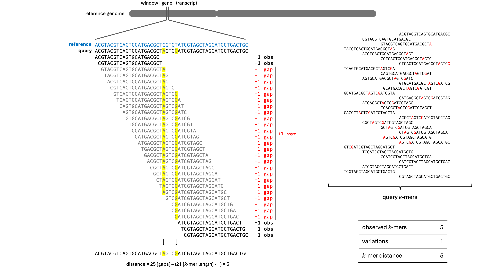
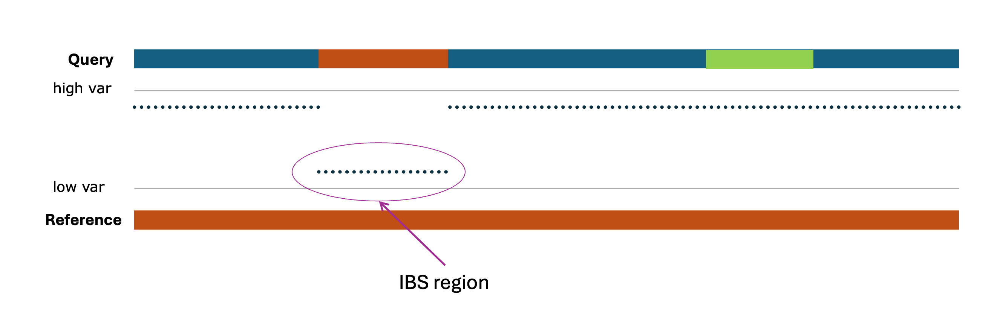
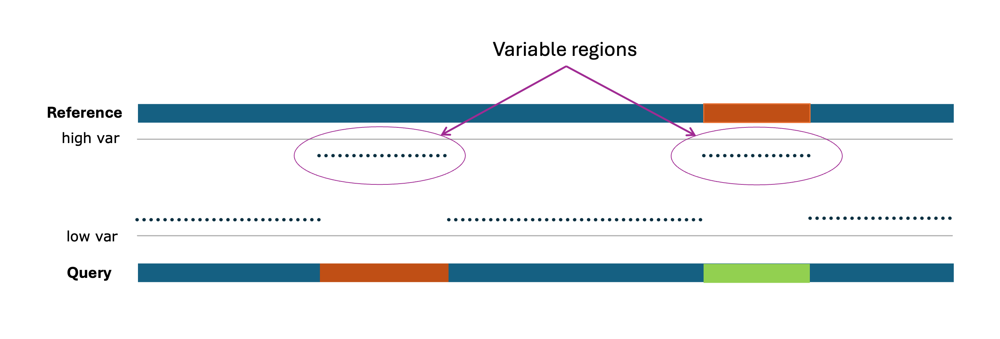

# Methodology

This section provides an overview of the methodology used in `kcftools` for genomic variation analysis. It explains how the tool leverages *k*-mer counting and the KMC database to identify variations, IBS windows, and generate genotype matrices.

---

## Variations
 The core functionality of the `kcftools` begins with screening variations between the reference and query genomes. The process starts with splitting the reference sequence into non-overlapping windows: either fixed-length regions, gene models, or transcript features from a GTF file—and the presence of reference *k*-mers is screened against query *k*-mer databases built using KMC3. For each window, the number of observed *k*-mers is counted, and variations are identified as consecutive gaps between matching *k*-mers. These gaps are used to compute the *k*-mer distance, representing the number of bases not covered by observed *k*-mers. This distance is divided into inner distance (gaps between hits within the window) and tail distance (gaps at the window edges), providing a detailed measure of sequence divergence or gene loss at multiple resolutions. The identity score for each window is being calculated using the below formula,

$$
\text{Identity Score} = W_o \cdot \left( \frac{\text{obs }k\text{-mers}}{\text{total k-mers}} \right) + W_i \cdot \left( 1 - \frac{\text{inner dist}}{\text{eff length}} \right) + W_t \cdot \left( 1 - \frac{\text{tail dist}}{\text{eff length}} \right) \cdot 100
$$

Where:

 - $W_o$, $W_i$, $W_t$
    : Weights assigned to the *k*-mer ratio, inner distance, and tail distance respectively.

 - **obs *k*-mers**
    : Number of *k*-mers from the reference window found in the query *k*-mer table.

 - **total *k*-mers**
    : Total number of *k*-mers from the reference window.

 - **inner dist**
    : Cumulative number of bases not covered by *k*-mers between hits within the window.

 - **tail dist**
    : Uncovered base positions at the start and end of the window (flanking gaps).

 - **eff length**
    : Effective length of the window (in base pairs), i.e., the portion covered by `total_kmers`.

  - **Identity Score**
    : A score between 0 and 100 indicating the degree of similarity between the reference and query sequences within the window.

**Figure**: Overview of the `getVariations` methodology for identifying variations between reference and query genomes.
---

## IBS Windows
The `findIBS` command identifies IBS (Identity by State) windows in the KCF file. It calculates the identity score for each window and filters (more than the cut-off) them based on a user-defined threshold. The IBS windows are then summarized in an output file, which includes the start and end positions, length, and identity score of each window. Consequent IBS windows are merged to create larger regions of identity, and the final output includes a summary of these regions.

**Figure**: Representative overview of IBS windows, where the 'low var' (possible higher Identity Score) regions are considered to be IBS windows. 

---
## Variable Regions
Similar to the IBS windows, the `findIBS` command can also be used to identify variable regions in the KCF file. It calculates the identity score for each window and filters (less than the cut-off) them based on a user-defined threshold. The variable regions are then summarized in an output file, which includes the start and end positions, length, and identity score of each region. Consequent variable regions are merged to create larger regions of variation, and the final output includes a summary of these regions.

**Figure**: Representative overview of Variable Regions, where the 'high var' (possible lower Identity Score) regions are considered to be variable regions.

