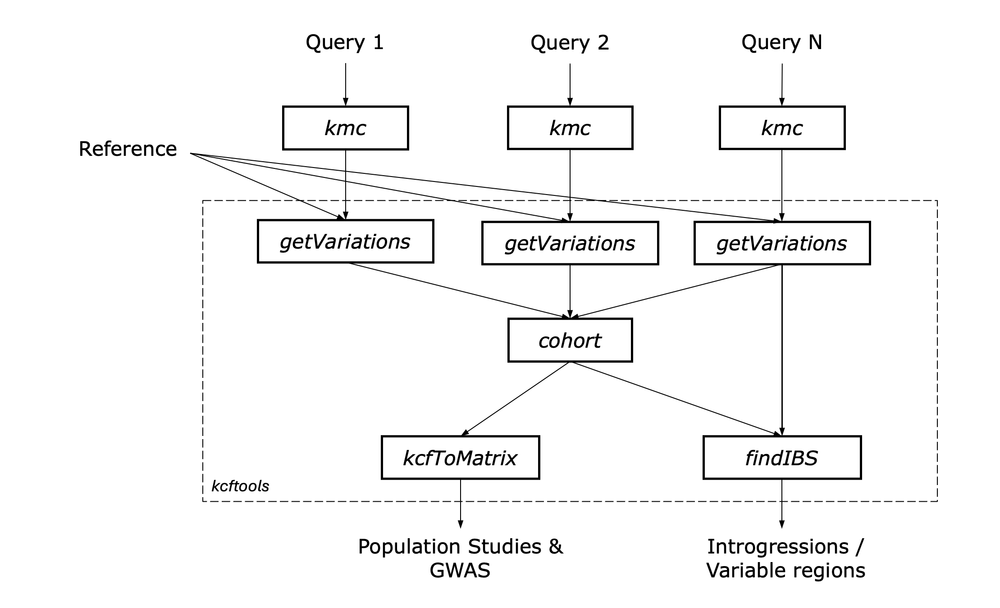

# kcftools Workflow

This page provides an overview of the workflow for using `kcftools` to analyze genomic variations. It covers the steps from *k*-mer counting to generating and analyzing KCF files.

### Workflow Overview

**Figure**: Overview of the `kcftools` workflow for genomic variation analysis.

### Input Data
The workflow begins with the input data (Query 1, Query 2, .. Query N), in kmc *k*-mer count database fomat generated from either one of the following:
- Genome sequences in FASTA format.
- Transcriptome sequences in FASTA format.
- Whole genome sequencing reads in FASTQ format.
- RNA sequencing reads in FASTQ format.
- Any other sequence data that can be processed by KMC to generate *k*-mer count databases.

### Output Data
- The general output data is generated in the KCF file format, which contains the variations identified between the reference genome and the query samples. Detailed explanations of the output files can be found in the [KCF File Format](formats/kcf.md) documentation.
- The IBS windows and variable regions are summarized in separate files, which include detailed information about the start and end positions, length, and identity scores of each window or region. The IBS summary file format is described in the [KCF IBS Summary File Format](formats/ibs.md) documentation.
- The genotype matrix is generated in a format suitable for further analyses in tools like [PLINK](https://www.cog-genomics.org/plink/), [Tassel](https://www.maizegenetics.net/tassel) or [GAPIT](https://zzlab.net/GAPIT/). The KCF Matrix File Format is described in the [KCF Matrix File Format](formats/matrix.md) documentation.
- The attributes extracted from the KCF file are output in a tab-separated format, which can be used for plotting and visualization of variation data. The KCF Attributes File Format is described in the [KCF Attributes File Format](formats/attributes.md) documentation.
- The KCF file can be converted to a tab-separated values (TSV) format for easier data handling and analysis. The KCF to TSV conversion is described in the [KCF to TSV](usage/kcf2tsv.md) documentation.

